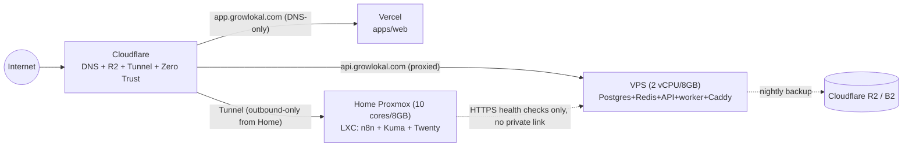

# Deployment Guide

A from-zero, step-by-step guide to standing up GrowLokal on your real hardware
and accounts. Written so a beginner can follow it top to bottom and actually
end up with a working, reasonably secure, self-healing system — and so that
when something breaks at 2am, there's a troubleshooting section that
actually matches what you deployed.

**Your exact stack, as specified:**

| # | Item | Role |
|---|---|---|
| 1 | VPS — 2 vCPU / 8GB RAM / 200GB SSD | Postgres, Redis, API, worker, Caddy (everything revenue-critical) |
| 2 | Home Proxmox — 1 socket / 10 cores / 8GB RAM / 500GB SSD | n8n, Uptime Kuma, Twenty CRM (tools only) |
| 3 | Cloudflare (free tier) | DNS, R2 (object storage), Tunnel, Zero Trust |
| 4 | Vercel | Hosts `apps/web` (the dashboard + marketing site) |
| 5 | Zoho Workplace (Standard) | Business mailboxes (hello@, billing@, support@) |
| 6 | OpenRouter | LLM + image generation |
| 7 | Google Maps API + GBP OAuth | Audit bot data + GBP posting |
| 8 | Razorpay | Payments/subscriptions |
| 9 | Uptime Kuma | Monitoring |
| 10 | QuickChart | Renders the WhatsApp "My Stats" chart |
| 11 | n8n | Ad-hoc internal automation |
| 12 | Twenty CRM | Leads/deals/revenue tracking |
| 13 | Caddy | Reverse proxy + automatic TLS on the VPS |
| 14 | Docker | Runs everything on both machines |
| 15 | REST API | `apps/api` (Fastify) |
| 16 | Redis | Conversation state + token caching |

Pairs with `docs/ARCHITECTURE.md` (why it's split this way), `docs/JOURNEYS.md`
(what actually happens end-to-end), and `IMPLEMENTATION.md` (the shorter
quick-start version of this same guide).

---

## 0. The one thing to understand before you touch anything

**The VPS and the home lab do NOT need a private network link to each other.**
This surprises people coming from a "server room" mental model, so it's worth
stating plainly:

- The VPS is reachable at `api.growlokal.com` — a normal public HTTPS address, same as any website.
- The home lab's tools (n8n, Kuma, Twenty) are reachable via a **Cloudflare Tunnel** — an *outbound-only* connection your home box makes to Cloudflare. Nothing ever connects *into* your home network.
- Nothing on the home lab calls into the VPS's private database. Uptime Kuma checks the VPS the same way a browser would — over the public internet, hitting `https://api.growlokal.com/health`.
- Backups go VPS → Cloudflare R2 / Backblaze B2 directly (both are internet-reachable cloud storage). The home lab is not involved in backups at all.

So: **two independent machines, each with its own path to the internet, tied
together only by Cloudflare DNS and cloud storage.** If you ever find
yourself trying to open a port so one can "talk to" the other directly,
stop — that's almost certainly not needed for anything in this stack today.



---

## 1. Before you start — accounts to create

Create these now; you'll need credentials from each as you go. None of this
costs anything beyond what's already in your list (all free tiers except
Zoho Workplace, which you already have).

- [ ] **Cloudflare** account, domain's nameservers pointed at it
- [ ] **Vercel** account, linked to your GitHub
- [ ] **Zoho Workplace** — you have this; note your account's data center region (`.com`/`.in`/`.eu` — check your Zoho admin URL)
- [ ] **OpenRouter** account + API key
- [ ] **Google Cloud** project — enable "Places API" and apply for "Google Business Profile API" access (this one has a real approval wait — apply first, build later)
- [ ] **Razorpay** account (start in Test Mode, switch to Live once verified)
- [ ] A way into your VPS (SSH key, not password) and your Proxmox box (its own web UI, LAN-only)

---

## 2. Cloudflare setup (do this first — everything else points here)

### 2.1 DNS — point your domain here
1. In your registrar, change nameservers to the two Cloudflare gives you (`*.ns.cloudflare.com`). Takes up to 24h to propagate, usually much faster.
2. In Cloudflare DNS, add these records (you'll fill in the actual targets as you reach each section below):

| Type | Name | Target | Proxy status |
|---|---|---|---|
| CNAME | `app` | `cname.vercel-dns.com` | **DNS only (grey cloud)** — Vercel needs to see real traffic |
| A | `api` | your VPS's public IP | Proxied (orange cloud) |
| CNAME | `n8n` | `<tunnel-id>.cfargotunnel.com` | Proxied |
| CNAME | `status` | `<tunnel-id>.cfargotunnel.com` | Proxied |
| CNAME | `crm` | `<tunnel-id>.cfargotunnel.com` | Proxied |
| MX | `@` | Zoho's MX records (see §6.2) | N/A (MX ignores proxy) |

The one setting people get wrong: **`app` must be grey-cloud (DNS only)**. If
you proxy it orange, Vercel's own SSL/CDN gets fought over by Cloudflare's,
and you get certificate errors.

### 2.2 R2 (object storage — for AI-generated images)
1. Cloudflare dashboard → R2 → Create bucket → name it `growlokal-media`.
2. R2 → Manage API Tokens → create a token with **Object Read & Write**, scoped to this bucket only (not admin-wide — smaller blast radius if it ever leaks).
3. Note down: **Account ID**, **Access Key ID**, **Secret Access Key**.
4. R2 bucket → Settings → enable **public access** (or set up a custom domain like `media.growlokal.com` pointed at the bucket — cleaner, and means you can rotate the bucket without changing every stored URL). Either way, note the public base URL.
5. Free tier covers 10GB storage + 10M reads/month + **zero egress fees** — comfortably enough for a small business's worth of AI-generated post images; you will not need to pay for this any time soon.

These become `R2_ACCOUNT_ID`, `R2_ACCESS_KEY_ID`, `R2_SECRET_ACCESS_KEY`, `R2_PUBLIC_URL_BASE` in your `.env`.

### 2.3 Tunnel (for the home lab — set this up in §4, referenced here for completeness)
You'll create this in the home lab section, but the DNS records above already assume it exists — come back and fill in the actual `<tunnel-id>` once you have one.

### 2.4 Zero Trust / Access (free, up to 50 users)
Cloudflare dashboard → Zero Trust → Access → Applications → add one for each
of `n8n.growlokal.com`, `status.growlokal.com`, `crm.growlokal.com`. Policy:
"Allow" only your own email (one-time PIN login). This is a **second layer**
on top of each app's own login (n8n's basic auth, Twenty's own auth) — not a
replacement for it. Kuma doesn't have built-in auth by default, so this is
the *only* thing protecting it — don't skip it for that one.

---

## 3. VPS setup (2 vCPU / 8GB / 200GB)

### 3.1 First login and lockdown
```bash
# From your local machine, generate a key if you don't have one:
ssh-keygen -t ed25519 -C "growlokal-vps"
# Copy it to the VPS (replace with your provider's initial login method):
ssh-copy-id root@YOUR_VPS_IP
```
Then on the VPS:
```bash
# Create a non-root user — never run Docker/production stuff as root day-to-day
adduser deploy
usermod -aG sudo deploy
mkdir -p /home/deploy/.ssh
cp ~/.ssh/authorized_keys /home/deploy/.ssh/
chown -R deploy:deploy /home/deploy/.ssh
chmod 700 /home/deploy/.ssh && chmod 600 /home/deploy/.ssh/authorized_keys
```
Edit `/etc/ssh/sshd_config`:
```
PasswordAuthentication no
PermitRootLogin no
```
```bash
sudo systemctl restart sshd
```
**Test the new user/key login in a SECOND terminal before closing your first
session** — if something's wrong with the key, you don't want to be locked
out with no way back in.

### 3.2 Firewall
```bash
sudo apt update && sudo apt install -y ufw fail2ban unattended-upgrades
sudo ufw default deny incoming
sudo ufw default allow outgoing
sudo ufw allow 22/tcp     # SSH
sudo ufw allow 80/tcp     # HTTP (Caddy uses this for the TLS challenge)
sudo ufw allow 443/tcp    # HTTPS
sudo ufw enable
sudo systemctl enable --now fail2ban
sudo dpkg-reconfigure --priority=low unattended-upgrades   # auto security patches
```
Notice **5432 (Postgres) and 6379 (Redis) are never opened** — they're bound
to `127.0.0.1` inside Docker already (see `infra/docker-compose.prod.yml`),
so nothing outside the VPS can reach them even if you forgot the firewall
rule. This is defense in depth, not redundant.

### 3.3 Install Docker
```bash
curl -fsSL https://get.docker.com | sudo sh
sudo usermod -aG docker deploy
# log out and back in for the group change to apply
docker --version && docker compose version
```

### 3.4 A small but important efficiency step: swap
At 8GB RAM with services already tightly budgeted (see §3.6), a single
memory spike shouldn't be able to instantly kill a container. Add a 2GB
swapfile as a safety net (SSD swap is fine for occasional bursts — just don't
rely on it for sustained load, that's a sign you need the 16GB upgrade):
```bash
sudo fallocate -l 2G /swapfile
sudo chmod 600 /swapfile
sudo mkswap /swapfile
sudo swapon /swapfile
echo '/swapfile none swap sw 0 0' | sudo tee -a /etc/fstab
```

### 3.5 Clone the repo and configure
```bash
sudo mkdir -p /opt/growlokal && sudo chown deploy:deploy /opt/growlokal
cd /opt/growlokal
git clone <your-repo-url> .
cp .env.example infra/.env
nano infra/.env   # fill in EVERY value — see §6 for where each one comes from
chmod 600 infra/.env
```

### 3.6 Bring up the stack
```bash
cd /opt/growlokal
docker compose -f infra/docker-compose.prod.yml up -d --build
docker compose -f infra/docker-compose.prod.yml ps   # all should say "healthy" or "running"
```
Memory budget at your current 8GB (already tight — this is the ceiling until
you get the 16GB upgrade you mentioned):

| Service | Memory limit |
|---|---|
| postgres | 3500M |
| redis | 1500M |
| api | 2000M |
| worker | 256M |
| caddy | 500M |
| **Total** | **7756M of 8192M** |

Run the database migrations once, in order:
```bash
docker compose -f infra/docker-compose.prod.yml exec -T postgres \
  psql -U growlokal -d growlokal < db/schema.sql
for f in db/migrations/*.sql; do
  docker compose -f infra/docker-compose.prod.yml exec -T postgres \
    psql -U growlokal -d growlokal < "$f"
done
```

### 3.7 Caddy + TLS
Nothing to configure by hand — `infra/Caddyfile` already points at
`api.growlokal.com` and Caddy auto-issues a Let's Encrypt certificate the
first time it starts, as long as:
- Cloudflare's `api` DNS record points at this VPS's IP (§2.1)
- Ports 80/443 are open (§3.2)

Verify:
```bash
curl -I https://api.growlokal.com/health
# should return: {"ok":true,"service":"growlokal-api"}
```

### 3.8 Nightly backups (run ON the VPS — see the fix note in `docs/BUG.md`)
```bash
sudo apt install -y rclone
rclone config   # set up a remote named "b2" or "r2" pointing at your bucket
sudo mkdir -p /opt/scripts
sudo cp infra/backup.sh /opt/scripts/backup.sh
sudo chmod +x /opt/scripts/backup.sh
# cron, as the deploy user (needs PG_PASSWORD/RCLONE_REMOTE in its env):
crontab -e
# add: 0 2 * * *  PG_PASSWORD=yourpass /opt/scripts/backup.sh >> /var/log/growlokal-backup.log 2>&1
```
**Restore-test this once, now, before you need it for real:**
```bash
gunzip -c /tmp/growlokal-db-*.sql.gz | docker compose -f infra/docker-compose.prod.yml exec -T postgres psql -U growlokal -d a_throwaway_test_db
```

---

## 4. Home Proxmox setup (10 cores / 8GB / 500GB)

### 4.1 Why an LXC container, not a VM
Proxmox supports both. For this workload, use an **LXC container**, not a
full VM: an LXC shares the host's kernel (near-zero overhead), while a VM
runs its own full OS (loses several hundred MB to a GB just existing). At
8GB total RAM with three real services to fit (n8n + Kuma + Twenty), that
difference matters. Use the VM route only if you specifically need kernel
isolation you don't have a reason to need here.

### 4.2 Create the LXC
In the Proxmox web UI (`https://<proxmox-ip>:8006`, **LAN-only — never expose
this port to the internet**, see §7.2):
1. **Create CT** → Template: Debian 12 (or Ubuntu 22.04) → CT ID: anything free.
2. Resources: **4 cores**, **6GB RAM** (leave ~2GB headroom for the Proxmox host itself and any future container), **60GB disk** (plenty for three lightweight services + logs).
3. Network: DHCP is fine, or a static LAN IP if you prefer predictability.
4. **Options → Start at boot: Yes** — this is what makes the container come back automatically after a power cut (§8).
5. Start the container, open its console.

### 4.3 Install Docker inside the LXC
```bash
apt update && apt install -y curl
curl -fsSL https://get.docker.com | sh
docker --version && docker compose version
```

### 4.4 Cloudflare Tunnel (this is what exposes n8n/Kuma/Twenty — no port-forwarding, ever)
```bash
curl -L --output cloudflared.deb https://github.com/cloudflare/cloudflared/releases/latest/download/cloudflared-linux-amd64.deb
dpkg -i cloudflared.deb
cloudflared tunnel login          # opens a browser link — authorize your Cloudflare account
cloudflared tunnel create growlokal-home
```
This prints a **Tunnel ID** and writes a credentials JSON file — go back to
§2.1 and fill in the real `<tunnel-id>.cfargotunnel.com` for the `n8n`,
`status`, and `crm` CNAME records now that you have it.

Copy `infra/cloudflared-config.example.yml` to `~/.cloudflared/config.yml`,
fill in the tunnel UUID, and replace the LAN IPs with `127.0.0.1` (cloudflared
and your Docker containers are on the *same* box now — no LAN hop needed):
```yaml
tunnel: <your-tunnel-uuid>
credentials-file: /root/.cloudflared/<your-tunnel-uuid>.json
ingress:
  - hostname: status.growlokal.com
    service: http://127.0.0.1:3001
  - hostname: crm.growlokal.com
    service: http://127.0.0.1:3010
  - hostname: n8n.growlokal.com
    service: http://127.0.0.1:5678
  - service: http_status:404
```
Run it as a service so it survives reboots:
```bash
cloudflared service install
systemctl enable --now cloudflared
```

### 4.5 Bring up the home-lab stack
```bash
mkdir -p /opt/growlokal && cd /opt/growlokal
git clone <your-repo-url> .
cp .env.example infra/.env   # fill in TWENTY_PG_PASSWORD, TWENTY_ENCRYPTION_KEY, N8N_PASSWORD
chmod 600 infra/.env
docker compose -f infra/docker-compose.yml up -d
docker compose -f infra/docker-compose.yml ps
```
Verify each is reachable: `https://status.growlokal.com`,
`https://crm.growlokal.com`, `https://n8n.growlokal.com` — all through
Cloudflare Access (§2.4), then each app's own login.

Memory budget at 6GB allocated to this LXC (rough, unmeasured — watch it via
Kuma once it's running):

| Service | Rough footprint |
|---|---|
| n8n (SQLite) | ~300MB |
| Kuma (SQLite) | ~150MB |
| Twenty (server + worker + its own Postgres + Redis) | ~2-3GB |
| **Total** | **~3-3.5GB of 6GB allocated** — real headroom |

### 4.6 First-run setup for each tool
- **Uptime Kuma**: create your admin account on first visit. Add a monitor for `https://api.growlokal.com/health` (HTTP, 60s interval) — this is your VPS's heartbeat. Add a notification channel (email via Zoho SMTP, or Telegram — whatever you'll actually check).
- **Twenty**: create your workspace + admin account. This is where leads/deals live going forward — nothing pushes data in automatically yet (no API integration built), so for now it's manual entry.
- **n8n**: log in with the basic-auth credentials you set. Nothing is wired up here today — it's a blank canvas for whatever ad-hoc automation you build later.

---

## 5. Vercel (frontend)

1. Import the repo in Vercel → **Root Directory: `apps/web`**.
2. Environment variable: `NEXT_PUBLIC_API_URL=https://api.growlokal.com`.
3. Custom domain: add `app.growlokal.com` — Vercel shows you a `cname.vercel-dns.com` target, which you already pointed to in §2.1 (grey cloud, not proxied).
4. Deploy. Vercel auto-issues its own SSL once it sees the CNAME resolve.

---

## 6. External services — filling in every `.env` value

### 6.1 OpenRouter
Dashboard → Keys → create one → `OPENROUTER_API_KEY`. Set `LLM_PROVIDER=openrouter`.
Model defaults are already sensible (`OPENROUTER_MODEL_QUALITY`,
`OPENROUTER_MODEL_IMAGE`) — check they still resolve on
[openrouter.ai/models](https://openrouter.ai/models) before going live, since
these IDs do change over time.

### 6.2 Zoho Workplace — two separate things, don't conflate them
- **Human mailboxes** (hello@, billing@, support@growlokal.com) — this is what
  Workplace Standard is actually for. Zoho Mail Admin Console → Domains →
  verify your domain (TXT record) → add the MX records it gives you (exact
  hostnames depend on your account's data center — check under Email
  Configuration in your own admin panel rather than trusting a generic list).
  Add the SPF/DKIM records it provides too, or your outbound mail from these
  addresses will land in spam.
- **Automated system emails** (payment confirmations, renewal reminders) —
  these come from `clients/email.ts` in the app, which uses **Amazon SES**,
  not Zoho — confirmed with the project owner (2026-08-18): staying on SES,
  no change. Zoho Workplace is for human mailboxes only; SES stays as the
  transactional sender. Nothing to build here — `clients/email.ts` is
  already correct as-is.

### 6.3 Google Maps / GBP
- **Places API**: Cloud Console → Enable API → create an API key → **restrict it** (HTTP referrer + API restriction) → set a billing cap in Cloud Console budgets (this is still an open gap — nothing in the app enforces this for you). → `GOOGLE_PLACES_API_KEY`.
- **GBP OAuth**: Cloud Console → Credentials → OAuth 2.0 Client ID (Web application) → Authorized redirect URI: `https://api.growlokal.com/api/gbp/oauth/callback` (must match `GBP_REDIRECT_URI` exactly). → `GBP_CLIENT_ID`, `GBP_CLIENT_SECRET`. Apply for Business Profile API access separately — this has its own approval queue, apply early.

### 6.4 Razorpay
- Dashboard → Settings → API Keys → generate → `RAZORPAY_KEY_ID`, `RAZORPAY_KEY_SECRET`.
- Settings → Webhooks → add `https://api.growlokal.com/webhooks/razorpay`, subscribe to `subscription.activated`, `subscription.charged`, `subscription.halted`, `subscription.cancelled` → copy the signing secret → `RAZORPAY_WEBHOOK_SECRET`.
- Subscriptions → Plans → create one Plan each for Starter (₹999/mo) and Growth (₹2,499/mo) → copy their Plan IDs → `RAZORPAY_PLAN_ID_STARTER`, `RAZORPAY_PLAN_ID_GROWTH`. These power the public `/checkout` page — get them right, or self-serve checkout 503s cleanly instead of charging the wrong amount (by design, not a bug).
- Start everything in **Test Mode** and do one real end-to-end test payment before flipping to Live keys.

### 6.5 QuickChart
Nothing to sign up for — `QUICKCHART_BASE_URL` defaults to their free hosted
instance (`https://quickchart.io`). Self-hosting on the home lab is the
upgrade path if you ever outgrow their free-tier rate limits; not needed now.

### 6.6 Meta WhatsApp Cloud API
Not in your numbered list but required for the WhatsApp bot to function at
all: Meta for Developers → create an app → WhatsApp product → get
`WHATSAPP_PHONE_NUMBER_ID`, `WHATSAPP_ACCESS_TOKEN`, `WHATSAPP_APP_SECRET`.
Point the webhook at `https://api.growlokal.com/webhooks/whatsapp` with
`WHATSAPP_VERIFY_TOKEN` matching what you set in `.env`. Several features
(renewal reminders, payment confirmations, website-request alerts,
GBP-no-locations alerts) also need Meta-approved message **templates** —
submit these for approval early, they all degrade gracefully to email-only
until approved, but the WhatsApp side won't work without them.

---

## 7. Security

### 7.1 VPS — what's already covered vs. what to keep watching
Already true from the setup above: SSH key-only, no root login, firewall
default-deny, fail2ban, Postgres/Redis never exposed beyond `127.0.0.1`,
automatic security patches, secrets in a `chmod 600` `.env` never committed
to git. Keep watching:
- **Google Places API has no billing cap set** — the single biggest
  still-open cost risk in this stack. Set one in Cloud Console today.
- **`/api/checkout` is public and rate-limited (10/min/IP)** but unauthenticated by design — watch for abuse spikes now that no human gates it (Kuma can't tell you this; you'd need to glance at API logs periodically).
- Rotate the R2 API token and Razorpay keys if you ever suspect a leak — both are scoped narrowly already, but rotation is still cheap insurance.

### 7.2 Home lab — Proxmox-specific
- **Never expose the Proxmox web UI (port 8006) to the internet.** It's meant to be LAN-only. If you need remote admin access, use a WireGuard VPN or Tailscale to reach your home LAN first, then hit `8006` as if you were home — do not port-forward it.
- The LXC gets the same SSH hardening as the VPS (§3.1/3.2) if you enable SSH into it at all.
- Cloudflare Tunnel means **zero inbound ports need to be opened on your home router** — resist the urge to port-forward anything "just to test" something faster; it's not needed for anything in this stack.
- Cloudflare Access (§2.4) is the only thing standing in front of Kuma, which has no login of its own — don't skip that step.

### 7.3 General
- `.env` files: `chmod 600`, never in git (already enforced by `.gitignore`).
- Before every `git push`, glance at `git status` for anything that looks like a stray credential file.
- Keep Docker images updated (`docker compose pull && docker compose up -d`) periodically — you're on `:latest`/pinned tags for third-party images (Twenty, n8n, Kuma), which means security patches arrive on your next pull, not automatically.

---

## 8. Graceful shutdown & power loss (this is the real risk with a home UPS)

Your VPS lives in a datacenter with its own power/generator redundancy —
not something you need to engineer around. **Your home lab, on a 3-hour UPS,
is the actual risk here.**

### 8.1 Automatic shutdown before the UPS dies, not after
A UPS that just silently runs out mid-write is worse than no UPS — it turns a
graceful shutdown opportunity into a hard crash. Fix this with NUT (Network
UPS Tools):
```bash
apt install -y nut nut-client
```
Connect the UPS to the Proxmox HOST (not the LXC) via USB, configure
`/etc/nut/ups.conf` for your specific model (varies by brand — check NUT's
compatibility list), and set `/etc/nut/upsmon.conf` to trigger a shutdown at
a safe battery threshold (e.g., 20% remaining, giving time for a clean stop
even under load). On mains power loss: NUT detects it, waits for either power
restoration or the threshold, then runs `poweroff` on the Proxmox host
cleanly — not a3-hour countdown to a hard cut.

### 8.2 What happens inside each container on shutdown
- **Postgres** (Twenty's own, inside the LXC) handles `SIGTERM` cleanly via its own WAL/crash-recovery — safe either way, but a clean stop is still strictly better than a hard cut.
- **`worker.ts`** on the VPS already has explicit `SIGINT`/`SIGTERM` handlers (`apps/api/src/worker.ts`) that clear its timers and close the DB pool before exiting — don't `kill -9` it if you can avoid it.
- Docker's default `docker compose stop` sends `SIGTERM` first, waits, then `SIGKILL`s — this is already the right behavior, no config needed.

### 8.3 Automatic recovery on power restoration
This is what actually matters for "I wasn't home when the power came back":
- Proxmox: the LXC's **"Start at boot: Yes"** setting (set in §4.2) means it comes back up automatically when the Proxmox host itself boots.
- Docker: every service in both `docker-compose.yml` and `docker-compose.prod.yml` already has `restart: always` — once Docker's daemon starts, it brings every container back without you touching anything.
- End-to-end: power restored → Proxmox boots → LXC auto-starts (if flagged) → Docker daemon starts inside it → all three services restart on their own. Test this once deliberately (pull the plug in a controlled way) rather than finding out during a real outage whether it actually works.

---

## 9. Efficiency

- **VPS is at its ceiling** (7756M of 8192M allocated) — this is fine for
  current scale, but don't add another service to `docker-compose.prod.yml`
  without either raising the VPS spec (you mentioned 4 vCPU/16GB as the
  next step) or trimming existing limits. The swapfile (§3.4) is a safety
  net, not a scaling strategy.
- **Home lab has real headroom** (~3-3.5GB of 6GB allocated to the LXC) —
  there's room here before you need the "second home-lab box" mentioned in
  `docs/ARCHITECTURE.md` for the heavier tools (Chatwoot, Mixpost, Cal.com).
- **Docker log rotation** — the default `json-file` log driver grows
  unbounded otherwise. Add this once, to `/etc/docker/daemon.json` on both
  machines, then restart Docker:
  ```json
  { "log-driver": "json-file", "log-opts": { "max-size": "10m", "max-file": "3" } }
  ```
- **Periodic cleanup** (monthly cron on both machines is plenty):
  ```bash
  docker system prune -f --volumes=false   # never auto-prune volumes — that's your data
  ```

---

## 10. Troubleshooting

| Symptom | Likely cause | Fix |
|---|---|---|
| `curl https://api.growlokal.com/health` times out | Caddy/API container down, or Cloudflare DNS not pointed at the VPS yet | `docker compose -f infra/docker-compose.prod.yml ps` — check which container is unhealthy; `docker compose logs api --tail 100` |
| Scheduled posts never publish, no error anywhere | The `worker` container is down — this fails silently by design (see `docs/FLOW.md` §5) | `docker compose -f infra/docker-compose.prod.yml ps worker` — if it's not "Up", `docker compose up -d worker` and check `docker compose logs worker` |
| Payments succeed on Razorpay but the account never appears | Webhook not reaching you, or wrong `RAZORPAY_WEBHOOK_SECRET` | Razorpay Dashboard → Webhooks → check delivery logs for `4xx`/`5xx`; confirm the secret in `.env` matches exactly |
| WhatsApp messages never send, no error | Missing/wrong `WHATSAPP_ACCESS_TOKEN`, or trying to message outside the 24h window without an approved template | Check API logs for `"WA send failed"`; confirm the relevant `WHATSAPP_*_TEMPLATE_NAME` is actually approved in Meta Business Manager |
| GBP posts stay in `draft`, never publish | No `gbp_refresh_token`/`gbp_location_id` for that business, or GBP API access not yet approved | Have the owner go through "Connect Google Business Profile" again; check `businesses.gbp_location_id` isn't null |
| Images never appear on posts | R2 not configured — this degrades to caption-only by design, not a crash | Check `R2_ACCOUNT_ID`/`R2_PUBLIC_URL_BASE` are set; `docker compose logs api \| grep "R2 not configured"` |
| Uptime Kuma shows the VPS down but it feels fine | DNS/Tunnel issue on the home-lab side, not the VPS | From the VPS itself, `curl localhost:3000/health` — if that works, the problem is Kuma's own network path, not the VPS |
| Home-lab tools (n8n/Kuma/Twenty) unreachable from outside | Tunnel not running, or DNS records not updated with the real tunnel ID | `systemctl status cloudflared` inside the LXC; `cloudflared tunnel list` to confirm it's actually connected |
| `docker compose up` fails immediately with a `:?` error | A required env var is genuinely unset (this is deliberate — see `JWT_SECRET`/`PG_PASSWORD` etc. in the compose files) | Read the exact error message — it names the missing var and where to set it |
| Everything was fine, then a power cut happened, and it's still down | NUT/auto-boot not actually configured, or the LXC's "start at boot" flag is off | SSH/console into Proxmox directly (LAN), check `pct status <id>`; `pct start <id>` manually, then go fix §8.1/§8.2 for next time |
| VPS running out of memory, containers restarting | Genuinely at the 8GB ceiling — see §9 | Check `docker stats` for the actual culprit; either trim a limit in `docker-compose.prod.yml` or move up to the 16GB VPS |

---

## 11. First-deploy checklist

- [ ] Cloudflare: DNS records correct, `app` is grey-cloud, R2 bucket created
- [ ] VPS: SSH key-only, firewall enabled, Docker installed, swap added
- [ ] VPS: `docker compose -f infra/docker-compose.prod.yml up -d --build` — all healthy
- [ ] VPS: migrations run, `curl https://api.growlokal.com/health` returns `ok:true`
- [ ] VPS: backup cron installed, **restore actually tested once**
- [ ] Home lab: LXC created with "start at boot", Docker installed
- [ ] Home lab: Cloudflare Tunnel running as a systemd service, all 3 hostnames resolve
- [ ] Home lab: `docker compose -f infra/docker-compose.yml up -d` — all healthy
- [ ] Home lab: NUT configured, one real UPS-triggered shutdown test done
- [ ] Vercel: deployed, `app.growlokal.com` resolves with a valid cert
- [ ] Every `.env` value in §6 filled in on the VPS side; home-lab `.env` has its own separate set (Twenty/n8n secrets only)
- [ ] Razorpay: Test Mode payment completed end-to-end before going Live
- [ ] Meta WhatsApp: webhook verified, at least one template submitted for approval
- [ ] Google Places: billing cap set (still not enforced by the app itself — this is on you)
