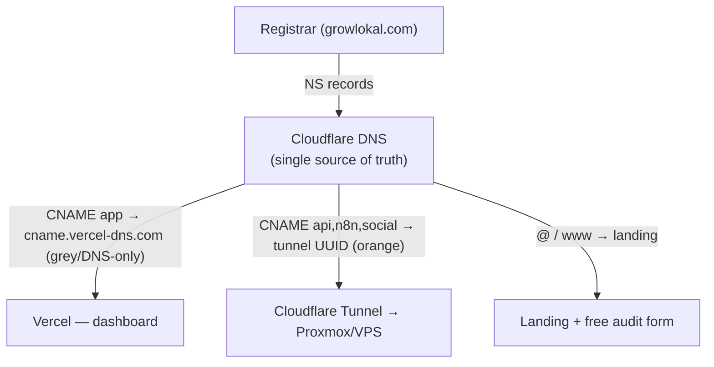

# Implementation Runbook

The single end-to-end process to get GrowLokal from empty machine → audit bot
replying on WhatsApp. Deep-dives live in the two guides in the parent folder:
- `../Technical-Setup-Guide.md` — Proxmox / Cloudflare Tunnel / Meta API / n8n
- `../Grexa-Competitor-GTM-Playbook.md` — the business plan
- `docs/ARCHITECTURE.md` — diagrams, `docs/ROADMAP.md` — what's built vs. TODO

> Status: code is authored but not yet run. Step 3 (typecheck + boot) is the
> first real gate — do it before anything else.

---

## What goes in Git vs. on the Server

**Rule of thumb:** Git holds *code + templates + docs*. The server holds
*secrets + data + runtime state*. Never commit the second set.

| Item | Git? | Where it lives at runtime |
|---|---|---|
| `apps/`, `db/`, `infra/`, `n8n/`, `prompts/`, `docs/` | ✅ commit | pulled onto server |
| `README.md`, `IMPLEMENTATION.md`, `.env.example` | ✅ commit | — |
| `.gitignore`, `package.json`, `pnpm-workspace.yaml` | ✅ commit | — |
| `.env` (real secrets) | ❌ **never** | server only, `chmod 600` |
| `*.pem`, `*.key`, `*-credentials.json`, `.cloudflared/` | ❌ never | server / Cloudflare only |
| `node_modules/`, `dist/`, `.next/` | ❌ never | built on server via `pnpm install && build` |
| Postgres data, `*.sql.gz` backups, `backups/` | ❌ never | server volume + offsite (B2/R2) |
| n8n workflow *state* (`.n8n/`) | ❌ never | server; export workflow JSON to `n8n/` to version it |
| Meta / Razorpay / Google API keys | ❌ never | in `.env` on server |

All of the ❌ rows are already in `.gitignore`. **Before your first push, run
`git status` and confirm no `.env` or key file is staged.**

---

## Phase 0 — Get it running (do this first, ~1 evening)

### 1. Prerequisites
- Node 20+, `pnpm` (`npm i -g pnpm`)
- Postgres 16 (local for dev, or the Proxmox `ct-postgres` container)

### 2. Clone + configure
```bash
git clone <your-repo> growlokal && cd growlokal
pnpm install
cp .env.example .env
# Edit .env: set DATABASE_URL. For a first boot you can leave API keys blank —
# Places returns mock data, LLM returns stub text, WhatsApp dry-runs.
```

### 3. Create the database
```bash
psql "$DATABASE_URL" -f db/schema.sql
psql "$DATABASE_URL" -f db/migrations/002_auth_billing.sql
psql "$DATABASE_URL" -f db/seed.sql          # optional demo data
```

### 4. THE FIRST GATE — typecheck + boot
```bash
pnpm --filter @growlokal/api typecheck        # must pass clean
pnpm --filter @growlokal/api test             # scoring unit tests
pnpm --filter @growlokal/api dev              # API on :3000
# new terminal:
pnpm --filter @growlokal/web dev              # dashboard on :3001
```
Verify: open http://localhost:3001, submit the audit form → you get a score
back (mock data until you add a Places key). Health: `curl localhost:3000/health`.

### 5. Wire real services (incrementally, in this order)
1. **Gemini key** → real vernacular content instead of stubs.
2. **Google Places key** → real audit data. ⚠️ restrict the key + set a billing cap.
3. **Meta WhatsApp** (test number first) → see `../Technical-Setup-Guide.md §4`.
   Point the webhook at your public URL (Cloudflare Tunnel, step 6).
4. **MSG91** (needs DLT) → real OTP SMS. Until then dev logs the code.
5. **Razorpay** (test mode) → subscriptions.

### 6. Expose the webhook (Cloudflare Tunnel)
Meta must reach your webhook publicly. See `../Technical-Setup-Guide.md §2`.
Quick dev option: `cloudflared tunnel --url http://localhost:3000`.

**Milestone:** a real WhatsApp message → audit bot replies with a score.
That's Phase 0 done.

---

## Phase 1 — Deploy for paying customers (month ~4)

Split per `docs/ARCHITECTURE.md`: customer-facing on a Bangalore VPS, automation
on home Proxmox.

### Web dashboard → Vercel (not the VPS)
The Next.js dashboard (`apps/web`) deploys to Vercel. Import the repo in Vercel,
set **Root Directory = `apps/web`**, and set env `PUBLIC_API_URL=https://api.growlokal.com`.
Vercel builds + hosts it; you don't run web on the VPS.

### On the VPS (public API, always-up)
```bash
git pull
pnpm install
pnpm --filter @growlokal/api build
# run under a process manager (pm2 / systemd), behind Cloudflare Tunnel
pnpm --filter @growlokal/api start
```
Source-of-truth Postgres lives here. The API serves both the web dashboard and
(later) the mobile app.

### On home Proxmox (backend)
- `infra/docker-compose.yml` → Postgres (replica/backup), Redis, n8n, Mixpost.
- Run the scheduler worker: `pnpm --filter @growlokal/api start:worker`.
- Nightly backups: cron `infra/backup.sh` → B2/R2. **Test a restore once.**

### Deploy checklist (before real customers — from docs/CHANGELOG.md TODOs)
- [ ] `JWT_SECRET` set to a long random value (not the dev default).
- [ ] Conversation state moved to Redis (currently in-memory).
- [ ] Meta webhook signature check (`X-Hub-Signature-256`).
- [ ] Rate-limit `/api/audit/run` + Cloudflare WAF on the webhook.
- [ ] Google Places key restricted + billing cap set.
- [ ] Admin tools (n8n, Metabase) behind Cloudflare Access.
- [ ] All `.env` values set; `git status` clean of secrets.

---

## DNS + Vercel plan (domain: growlokal.com)

**Key point:** Cloudflare and Vercel do NOT conflict. **Cloudflare owns DNS**
(nameservers point to it). Vercel is just an app host that Cloudflare points to
with a CNAME. You never point nameservers at Vercel — if you did, the Cloudflare
Tunnel (API, n8n, Mixpost on Proxmox) would break. One DNS panel: Cloudflare.



### One-time setup
1. **Registrar:** set nameservers to the two Cloudflare gives you (`*.ns.cloudflare.com`). Only nameserver change there is; ~1–24h to propagate.
2. **Vercel:** add `app.growlokal.com` as a custom domain on the project (Root Dir `apps/web`). Vercel shows a target `cname.vercel-dns.com`.
3. **Cloudflare DNS:** add `CNAME  app  →  cname.vercel-dns.com`, **set to "DNS only" (grey cloud), NOT proxied**. Vercel needs to see requests for its own SSL/CDN. (This is the one setting people get wrong.)
4. Vercel auto-issues SSL once it sees the CNAME. Done.

### Subdomain map
| Subdomain | Cloudflare record → | Proxy | Purpose |
|---|---|---|---|
| `growlokal.com` / `www` | landing (Vercel or static) | orange | Marketing + free audit form |
| `app.growlokal.com` | `cname.vercel-dns.com` | **grey (DNS only)** | Owner dashboard (Vercel) |
| `api.growlokal.com` | Tunnel UUID | orange | **API — used by web AND future mobile** |
| `n8n / social / metrics.growlokal.com` | Tunnel UUID | orange + Access | Internal tools on Proxmox |

### Mobile app (future)
The API is already a clean REST service at `api.growlokal.com` — the mobile app
(React Native/Flutter) calls the **same** endpoints the dashboard uses. Auth is
JWT-in-header (`Authorization: Bearer`), which works identically on mobile
(store the token in secure storage). No backend rewrite needed.
When you start mobile, add a `/v1/` route prefix then — don't pre-build it now.

---

## First-push checklist
```bash
git init
git add -A
git status                 # ← confirm NO .env, no *.key, no node_modules
git commit -m "Initial commit: GrowLokal scaffold + audit bot"
git branch -M main
git remote add origin <your-repo-url>
git push -u origin main
```
