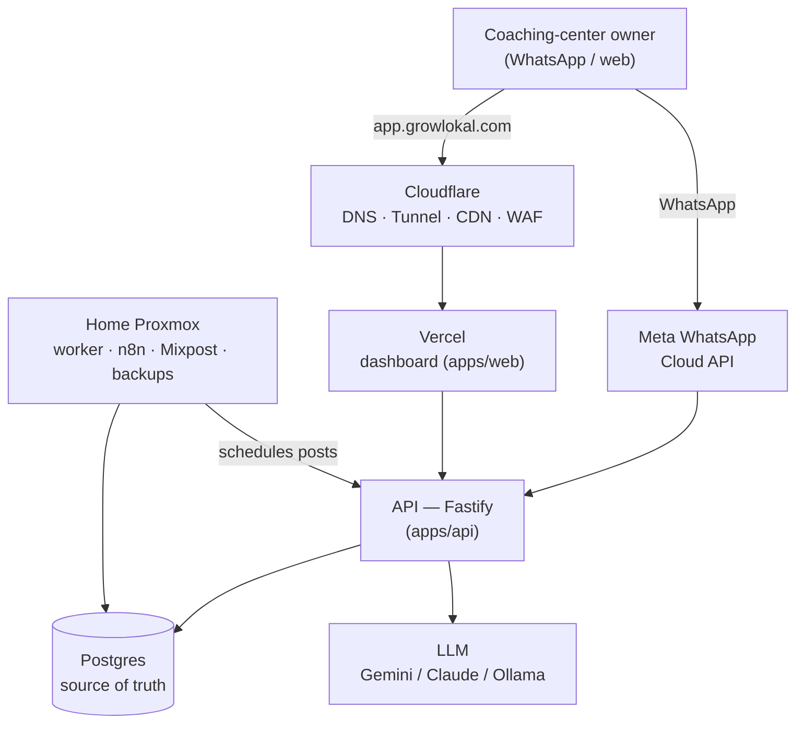

# GrowLokal — AI Marketing Platform for South Indian Local Businesses

An open-source, self-hostable alternative to Grexa.ai, targeting **coaching & tuition centers in Hyderabad and across South India**, in **Telugu / Tamil / Kannada + English (Hinglish)**.

Designed for a lean self-hosted stack — home Proxmox server + Cloudflare Tunnel + a cheap Bangalore VPS + Vercel for the dashboard — on a ~₹10K/month budget.

> Strategy docs live outside the repo: `../Grexa-Competitor-GTM-Playbook.md` (go-to-market) and `../Technical-Setup-Guide.md` (Proxmox / Cloudflare / Meta API setup).

## Architecture



Full diagrams (system + audit-bot sequence) in [`docs/ARCHITECTURE.md`](docs/ARCHITECTURE.md).

## Features

| Feature | Backend | Dashboard UI |
|---|---|---|
| **Audit bot** — free WhatsApp "Google visibility report" lead magnet | ✅ | ✅ (web form) |
| **Auth** — phone OTP → JWT, tenant-scoped | ✅ | ✅ `/login` |
| **Onboarding** — fills business profile the AI uses | ✅ | ✅ `/onboarding` |
| **GBP agent** — AI Google posts + review-reply drafts | ✅¹ | ✅ |
| **Social scheduler** — Instagram/FB via Mixpost + worker | ✅ | ✅ |
| **WhatsApp campaigns** — prepaid-credit accounting | ✅ | ✅ `/campaigns` |
| **Billing** — Razorpay subscriptions + signed webhook | ✅ | — |
| **Booking microsite** — public per-center page (wa.me + UPI) | ✅ | ✅ `/c/:id` |
| **ROI dashboard** — "X enquiries this month" | ✅ | ✅ |

¹ GBP *publishing* is gated on Google API approval (0 QPM until approved); drafts save meanwhile.

**Status:** all product features have backend + UI. API typechecks clean, web `next build` passes, audit scoring has passing unit tests. Remaining work is *hardening* (Redis for chat state, Meta webhook signature, rate-limiting), not features — see [`docs/CHANGELOG.md`](docs/CHANGELOG.md).

## Repo layout

```
project/
├── apps/
│   ├── api/          # Fastify TypeScript API — webhooks, audit bot, all business logic
│   └── web/          # Next.js dashboard (App Router) — deploys to Vercel
├── db/               # Postgres schema (source of truth) + migrations + seed
├── infra/            # docker-compose (self-hosted tools), cloudflared, backup script
├── n8n/              # importable workflow JSON (social scheduler)
├── prompts/          # vernacular LLM prompt templates (editable by non-devs)
└── docs/             # architecture, data model, roadmap, changelog
```

## Quick start (local dev)

```bash
cp .env.example .env                              # set DATABASE_URL (API keys optional for first boot)
pnpm install
psql "$DATABASE_URL" -f db/schema.sql
psql "$DATABASE_URL" -f db/migrations/002_auth_billing.sql
psql "$DATABASE_URL" -f db/seed.sql               # optional demo data
pnpm --filter @growlokal/api dev                   # API  :3000
pnpm --filter @growlokal/web dev                   # web  :3001
```

With no API keys set, Places returns mock data, the LLM returns stub text, and WhatsApp dry-runs — so the app boots and the audit form works end-to-end for a first look.

**Full setup, deploy, DNS + Vercel, and Git-vs-server split →
[`IMPLEMENTATION.md`](IMPLEMENTATION.md).** Start there.

## Ship this first

The **audit bot** (`apps/api/src/features/audit/`) is the acquisition engine: an owner WhatsApps their business name → gets an instant Telugu/English report on what they're losing on Google → becomes a captured lead. Get it live before anything else. See [`docs/ROADMAP.md`](docs/ROADMAP.md).

## License

Proprietary. Add a LICENSE file before making the repo public.
