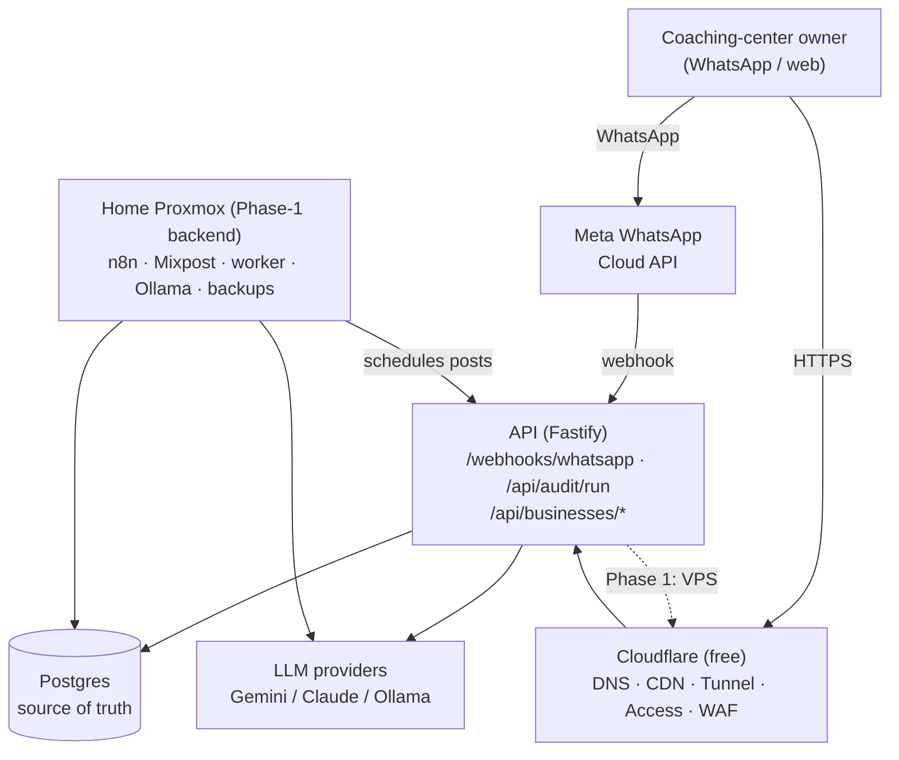
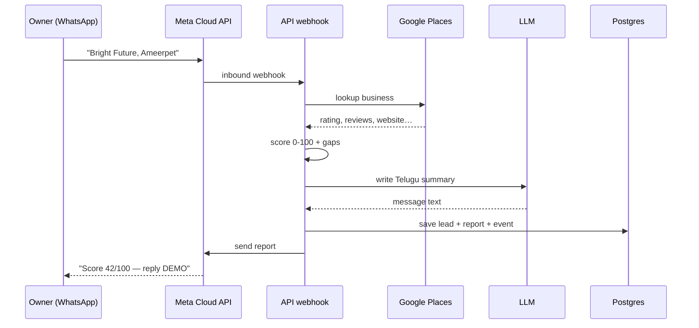

# Architecture

## The two-phase hosting model

**Phase 0 (build + pilots):** everything on the home Proxmox box, exposed via Cloudflare Tunnel. Cost ≈ ₹0 + LLM credits.

**Phase 1 (paying customers):** customer-facing path moves to a ₹1,000–1,200 Bangalore VPS; home box becomes the automation/compute backend.

```
                    ┌─────────────────────────────────────────┐
   Coaching-center  │            Cloudflare (free)             │
   owner on         │   DNS · CDN · Tunnel · Access · WAF      │
   WhatsApp / web   └───────────────┬─────────────────────────┘
        │                           │ (outbound tunnel, no public IP needed)
        │ WhatsApp Cloud API        │
        ▼                           ▼
   ┌─────────┐        ┌──────────────────────────────────────┐
   │  Meta   │◀──────▶│  API (Fastify)   app.  api.           │  ← VPS in Phase 1
   │ WA Cloud│webhook │  - /webhooks/whatsapp (audit bot)     │
   └─────────┘        │  - /api/audit/run                     │
                      │  - /api/businesses/* (GBP/social/…)   │
                      └───────┬───────────────────┬───────────┘
                              │                   │
                     ┌────────▼─────┐      ┌───────▼────────┐
                     │  Postgres    │      │  LLM providers │
                     │ (source of   │      │ Gemini/Claude/ │
                     │  truth)      │      │ Ollama(local)  │
                     └──────────────┘      └────────────────┘
                              ▲
        ┌─────────────────────┴───────────── Home Proxmox (Phase 1 backend) ──┐
        │  n8n (schedules) · Mixpost (IG/FB) · Chatwoot · Cal.com · Metabase   │
        │  Ollama (cheap drafts) · nightly backups → B2/R2                     │
        └─────────────────────────────────────────────────────────────────────┘
```

## System diagram (rendered on GitHub)



### Audit bot flow (the lead magnet)



## Components

- **`apps/api`** — the brain. WhatsApp webhook, audit bot, business logic, LLM/Places/WhatsApp clients. Stateless (except the in-memory convo map → move to Redis for prod).
- **`apps/web`** — Next.js dashboard for center owners (ROI, content approval, campaigns) and for your sales team (leads).
- **Postgres** — single source of truth (`db/schema.sql`). Everything else (Metabase, NocoDB) reads from it.
- **n8n** — scheduling + orchestration; calls the API rather than reimplementing logic.
- **Self-hosted tools** — Mixpost (social), Chatwoot (inbox), Cal.com (booking), Listmonk (email), Metabase (dashboards).

## Data flow: the audit bot (fully built)

1. Owner WhatsApps the business number → Meta → `POST /webhooks/whatsapp`.
2. Conversation SM asks for the business name.
3. `runAudit()` → Google Places lookup → `scoreBusiness()` → `llm.generate()` (vernacular) → persist `lead` + `audit_report` + `events`.
4. Reply sent via WhatsApp Cloud API. "DEMO" → lead marked `demo_booked` → sales follows up.

## Key decisions & rationale

- **Direct Meta Cloud API, not a BSP** — saves ₹2,500–3,800/mo; you pay only per-message.
- **LLM tiering** — cheap model for bulk drafts, quality model for customer-facing vernacular; keeps cost ~₹0.60/business/mo.
- **Money in paise (integers)** — no float rounding bugs in billing/credits.
- **API-first logic, n8n for orchestration** — keeps logic unit-testable.
- **Multi-tenant by `business_id`** — but leads exist pre-signup (audit bot captures them before they're customers).

## Known gaps / TODO before production

- Move conversation state from in-memory `Map` to **Redis** (survives restarts, multi-instance).
- Add **webhook signature verification** for Meta (X-Hub-Signature-256) and Razorpay.
- Add **auth** (phone-OTP) to the dashboard + protect `/api/businesses/*`.
- **Rate-limit** the audit endpoint (Places + LLM cost per hit) + Cloudflare WAF rule.
- Restrict the Google Places API key + **billing cap**.
- Real **GBP / Mixpost / campaign** integrations (currently stubs).
