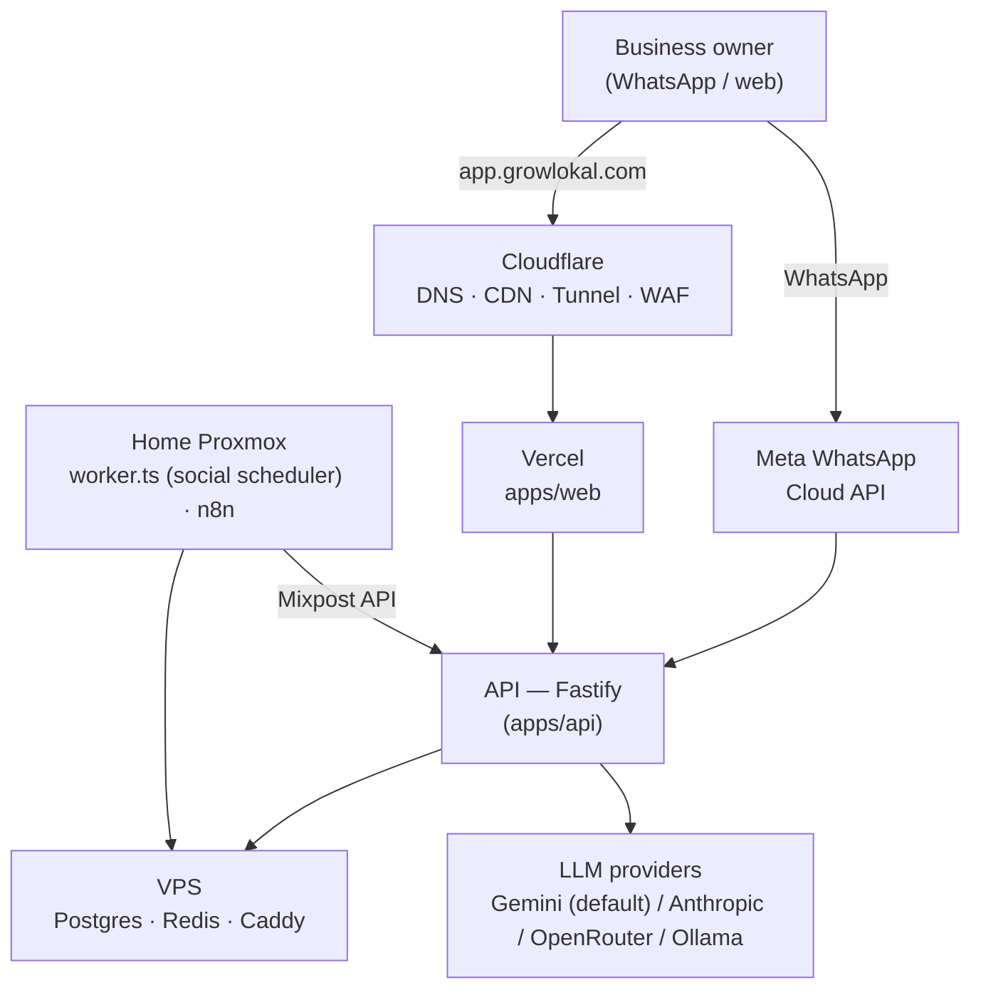

# Architecture

The system map — read this before touching anything you didn't write. Pairs with `FLOW.md` (how execution moves between files) and `DECISIONS.md` (why it's built this way).

## Hosting model: Vercel (web) + VPS (API/data) + home lab (tools)

- **`apps/web`** (Next.js dashboard, landing page, SEO pages) deploys to **Vercel**.
- **`apps/api`** (Fastify), **Postgres**, and **Redis** run on a **dedicated VPS** (`infra/docker-compose.prod.yml`), fronted by **Caddy** for automatic HTTPS. This is the only revenue-critical machine — it can't depend on home power/internet.
- **Cloudflare** owns DNS for `growlokal.com` (nameservers point there). `app.growlokal.com` is a Cloudflare CNAME to Vercel (DNS-only, not proxied); `api.growlokal.com` reaches the VPS directly (its own public IP, Caddy issues its own cert) once provisioned, or via Cloudflare Tunnel during the build phase. Home-lab tool subdomains (`status`, `crm`, `n8n`, …) always go through a **Cloudflare Tunnel** — deliberately, even though the home box has its own public IP now (see `DECISIONS.md` 2026-08-18): a home box shares a network with personal devices, unlike a disposable VPS, so no inbound port is opened there; Tunnel also doesn't care whether the IP is static. See `IMPLEMENTATION.md` for the exact DNS split and why Cloudflare/Vercel don't conflict.
- **Home lab — box #1** (a laptop: i5-1235U, 8GB RAM, public IP, UPS-backed) is **tools only, nothing revenue-critical**: **n8n** (own embedded SQLite), **Uptime Kuma** (monitoring dashboard for the VPS API + this box's own tools, own SQLite), **Twenty CRM** (admin/finance: leads, deals, revenue — own bundled Postgres/Redis, isolated from the VPS's production database by design). Each tool is fully self-contained — no Postgres/Redis is shared between them, so a bug in one can't take another down. 8GB is a real ceiling — this box does not also run the heavier tools below.
- **Home lab — box #2** (a second laptop, not yet set up) is reserved for the heavier self-hosted tools once RAM demands it: Mixpost, Chatwoot, Cal.com, Metabase, Listmonk — referenced in `infra/docker-compose.yml` as commented-out additions, and given a separate LAN IP block in `infra/cloudflared-config.example.yml`.
- **The scheduler worker (`apps/api/src/worker.ts`, a separate process/container from the API) now runs on the VPS** (`infra/docker-compose.prod.yml`'s `worker` service), not the home lab — moved 2026-08-18 (see `DECISIONS.md`): it writes to production tables (`posts`, `subscriptions`) and sends real customer/owner messages, which makes it revenue-adjacent, not a "tool," and it shouldn't depend on home power/internet.



### Audit bot flow (the lead magnet — see `FLOW.md` §1 for the full trace)

```mermaid
sequenceDiagram
    participant O as Owner (WhatsApp or web form)
    participant A as API
    participant G as Google Places
    participant L as LLM
    participant DB as Postgres

    O->>A: business name (+ phone, if via WhatsApp)
    A->>G: lookup business (12h cache)
    G-->>A: rating, reviews, website…
    A->>A: score 0-100 + gaps (pure function, unit-tested)
    A->>L: write vernacular summary
    L-->>A: message text
    A->>DB: save lead + audit_report + event
    A-->>O: score + summary; "reply DEMO" (WhatsApp) or shown on page (web)
```

## Components

- **`apps/api`** — all business logic. WhatsApp webhook (signature-verified), audit bot, auth (phone OTP + JWT), GBP agent, social scheduler, WhatsApp campaigns, Razorpay billing. Conversation state lives in **Redis**, not memory — survives restarts and works across multiple instances.
- **`apps/api/src/worker.ts`** — a **separate process** from the API server; polls every 60s for scheduled social posts and publishes them via Mixpost. If you deploy/restart only the API, this process (and scheduled publishing) stops unless it's also running.
- **`apps/web`** — the dashboard (owners: ROI, content, campaigns; sales: leads), plus the public marketing site (landing page, `/city/[cityName]` and `/city/[cityName]/[vertical]` SEO pages, blog, legal pages, ROI/audit calculators).
- **Postgres** — single source of truth (`db/schema.sql` + `db/migrations/*.sql`, applied in order).
- **Redis** — two real uses today: WhatsApp conversation-state (24h TTL) and a cached GBP OAuth access token (~50min TTL). **Not a job queue** — the worker is a plain polling loop by design (see its own header comment for when to graduate to something like BullMQ).
- **Self-hosted tools (planned, not all deployed)** — Mixpost (social posting, referenced by the worker), n8n (orchestration), Chatwoot/Cal.com/Metabase (not yet integrated).

## Data model highlights

See `docs/DATA_MODEL.md` for the full schema rationale. The two things most likely to surprise you:
- **`leads` exist independently of `businesses`** — the audit bot captures a phone number + business name as a lead *before* anyone signs up. A lead only links to a business via `converted_business_id` once/if they subscribe.
- **Money is always integer paise** (`₹999` = `99900`) — never introduce a float for a money column.

## Key decisions & rationale

(Full list with dates in `DECISIONS.md` — highlights only here.)

- **Direct Meta Cloud API, not a WhatsApp BSP** — saves the ₹2,500–3,800/mo subscription; pay only per-message.
- **LLM tiering** (`cheap`/`quality` in `clients/llm.ts`) — `quality` for anything customer-facing, `cheap` reserved for future non-customer-facing bulk work. As of 2026-08-18, every actual content-generation call in the codebase (audit summaries, GBP/social/campaign content, the chat agent) runs on `quality` — social posts were the last one still on `cheap` and moved up (see `DECISIONS.md`). Real per-business LLM cost hasn't been measured against production traffic; each business posts a handful of times a week, so the total delta from this move should stay small, but this is an estimate, not a measured number.
- **API-first logic, tools for orchestration** — business logic lives in testable TypeScript (`features/*/service.ts`), not inside n8n workflows or the frontend.
- **Vertical-neutral by design** — `profile_context` is freeform JSON; the product isn't hardcoded to one business type (this was actively fixed after drifting coaching-specific — see `DECISIONS.md`).
- **GBP OAuth: mechanism built, consent flow deliberately not** — see `DECISIONS.md`; building an unusable redirect route before you have a Google Cloud OAuth client and approved GBP access would be untestable scaffolding.

## Known gaps (as of 2026-07-11 — check `DECISIONS.md` and `docs/ROADMAP.md` for anything resolved since)

**Entitlement enforcement now exists** (`auth/entitlement.ts` + `components/PlanGate.tsx` — see `DECISIONS.md`/`FEATURE.md` for the full design). GBP, social, campaigns, the booking microsite, and the WhatsApp chat agent all check `businesses.plan`/`status` before running; the dashboard shows only a renewal/upgrade wall when a business isn't entitled. See `FLOW.md` §8 for the current map.

**What's still not built** (billing/customer-journey gaps):
- No invoice generation (decision made: use Razorpay's built-in invoicing, not a custom one — not yet implemented; the pay-first flow's confirmation message doesn't include an invoice link yet).
- No downgrade protection in the pay-first flow — attaching a lower-tier payment to an existing higher-tier business simply sets the lower plan, no warning (deliberately out of scope for now, see `DECISIONS.md`).
- WhatsApp broadcast campaigns need a Meta-approved message template — status unconfirmed, explicitly deferred by the project owner (2026-08-18).
- "Booking microsite" is really an enquiry/contact page (WhatsApp link + optional UPI pay link), not real date/time appointment booking — Cal.com integration is the planned fix, not yet built.

**Resolved 2026-08-18:**
- ~~Dashboard could only generate Instagram posts, never Facebook~~ — despite Facebook being sold on the pricing page. Dashboard button was hardcoded; now parametrized.
- ~~"Weekly" GBP/social posts required a human to click a button every single time~~ — the single biggest gap between the marketing promise and reality, found during a pricing audit. `worker.ts`'s `checkWeeklyAutoPosts()` now auto-generates for any entitled business with no post in 7 days, re-checking entitlement fresh on every run.
- ~~No AI image generation anywhere~~ — GBP/Instagram/Facebook posts now get one AI image each (FLUX.2 Klein 4B via OpenRouter, hosted on Cloudflare R2). Deliberately not built for campaigns/chat (text-only) or X/LinkedIn (project owner's call — not where this product's customers are).
- ~~Pro plan advertised multi-branch/multi-location support that never existed in the schema~~ — dropped entirely rather than left as a false promise. `plan_tier` DB enum and `PlanTier`/`PLAN_RANK` in `entitlement.ts` deliberately left untouched (inert, not worth a migration).
- ~~WhatsApp bot only ever supported plain text — no buttons, no images, in either direction~~ — genuinely behind a competitor's baseline UX, found while scoping a "make our bot more advanced" request. `clients/whatsapp.ts` now has `sendButtons`/`sendList`/`sendImage`; `routes/whatsapp.ts` now parses `msg.interactive` (button/list taps), not just `msg.text`.
- ~~An existing paying customer messaging our platform number got the same "what's your business name" script as a brand-new lead~~ — now routed to a real self-service menu (My Stats via a real chart image, Get a Website → priority team alert) by matching `users.phone`. See `FLOW.md` §12.

**Resolved 2026-07-11 (Chunk C):**
- ~~Current signup flow is sign-up-then-pay only~~ — a business can now also come into existence via a paid checkout link, with the business/user/subscription rows created atomically the moment payment succeeds. Sales-assisted (a team member generates the link), not public self-serve — see `DECISIONS.md` for why, and how the same mechanism would support self-serve later.
- ~~No payment-confirmation email or WhatsApp message is ever sent~~ — sent on both paths now (`routes/billing.ts`'s `sendPaymentConfirmation()`): pay-first provisioning, and the existing sign-up-then-pay `/billing/subscribe` path (added while documenting this chunk — the two paths had drifted to send different things).

**Resolved 2026-07-11 (Chunk E):**
- ~~No dashboard UI showing plan expiry date~~ — `ExpiryBadge` on the main dashboard now shows it.
- ~~No scheduled job for renewal reminders~~ — `worker.ts`'s `checkRenewalReminders()`, every 6h. WhatsApp side needs a Meta-approved template before it actually sends; email side needs real SES credentials configured.
- ~~No email system exists at all~~ — `clients/email.ts` (Amazon SES) now exists and is reusable for payment confirmations/invoices whenever those get built.
- Entitlement now also checks `current_period_end` directly (not just `businesses.status`), so there's no dependency on Razorpay webhook timing and no separate "suspend" job is needed.

**Smaller/operational gaps:**
- Restrict the Google Places API key + set a billing cap (it's called on every audit + autocomplete keystroke; rate-limited but not capped).
- Self-hosted tools referenced in `infra/docker-compose.yml` (Mixpost, Chatwoot, Cal.com, Metabase) aren't all actually deployed yet — the worker's Mixpost calls dry-run until a real instance + per-business account IDs exist.
