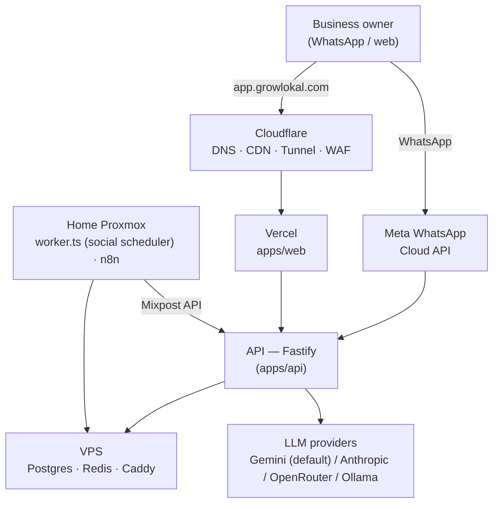

# Architecture

The system map — read this before touching anything you didn't write. Pairs with `FLOW.md` (how execution moves between files) and `DECISIONS.md` (why it's built this way).

## Hosting model: Vercel (web) + VPS (API/data) + home Proxmox (automation)

- **`apps/web`** (Next.js dashboard, landing page, SEO pages) deploys to **Vercel**.
- **`apps/api`** (Fastify), **Postgres**, and **Redis** run on a **dedicated VPS** (`infra/docker-compose.prod.yml`), fronted by **Caddy** for automatic HTTPS.
- **Cloudflare** owns DNS for `growlokal.com` (nameservers point there). `app.growlokal.com` is a Cloudflare CNAME to Vercel (DNS-only, not proxied); `api.growlokal.com` and internal tools are reached via a **Cloudflare Tunnel** to the home Proxmox box during the build/pilot phase, or directly to the VPS once provisioned. See `IMPLEMENTATION.md` for the exact DNS split and why Cloudflare/Vercel don't conflict.
- **Home Proxmox server** runs the automation layer: the scheduler worker (`apps/api/src/worker.ts`, a separate process from the API), and self-hosted tools referenced in `infra/docker-compose.yml` (n8n, and — not yet deployed — Mixpost, Chatwoot, Cal.com, Metabase).



### Audit bot flow (the lead magnet — see `FLOW.md` §1 for the full trace)

```mermaid
sequenceDiagram
    participant O as Owner (WhatsApp or web form)
    participant A as API
    participant G as Google Places
    participant L as LLM
    participant DB as Postgres

    O->>A: business name (+ phone, if via WhatsApp)
    A->>G: lookup business (12h cache)
    G-->>A: rating, reviews, website…
    A->>A: score 0-100 + gaps (pure function, unit-tested)
    A->>L: write vernacular summary
    L-->>A: message text
    A->>DB: save lead + audit_report + event
    A-->>O: score + summary; "reply DEMO" (WhatsApp) or shown on page (web)
```

## Components

- **`apps/api`** — all business logic. WhatsApp webhook (signature-verified), audit bot, auth (phone OTP + JWT), GBP agent, social scheduler, WhatsApp campaigns, Razorpay billing. Conversation state lives in **Redis**, not memory — survives restarts and works across multiple instances.
- **`apps/api/src/worker.ts`** — a **separate process** from the API server; polls every 60s for scheduled social posts and publishes them via Mixpost. If you deploy/restart only the API, this process (and scheduled publishing) stops unless it's also running.
- **`apps/web`** — the dashboard (owners: ROI, content, campaigns; sales: leads), plus the public marketing site (landing page, `/city/[cityName]` and `/city/[cityName]/[vertical]` SEO pages, blog, legal pages, ROI/audit calculators).
- **Postgres** — single source of truth (`db/schema.sql` + `db/migrations/*.sql`, applied in order).
- **Redis** — two real uses today: WhatsApp conversation-state (24h TTL) and a cached GBP OAuth access token (~50min TTL). **Not a job queue** — the worker is a plain polling loop by design (see its own header comment for when to graduate to something like BullMQ).
- **Self-hosted tools (planned, not all deployed)** — Mixpost (social posting, referenced by the worker), n8n (orchestration), Chatwoot/Cal.com/Metabase (not yet integrated).

## Data model highlights

See `docs/DATA_MODEL.md` for the full schema rationale. The two things most likely to surprise you:
- **`leads` exist independently of `businesses`** — the audit bot captures a phone number + business name as a lead *before* anyone signs up. A lead only links to a business via `converted_business_id` once/if they subscribe.
- **Money is always integer paise** (`₹999` = `99900`) — never introduce a float for a money column.

## Key decisions & rationale

(Full list with dates in `DECISIONS.md` — highlights only here.)

- **Direct Meta Cloud API, not a WhatsApp BSP** — saves the ₹2,500–3,800/mo subscription; pay only per-message.
- **LLM tiering** (`cheap`/`quality` in `clients/llm.ts`) — cheap model for bulk drafts, quality model for anything customer-facing; keeps LLM cost negligible (well under ₹1/business/month on the cheap tier).
- **API-first logic, tools for orchestration** — business logic lives in testable TypeScript (`features/*/service.ts`), not inside n8n workflows or the frontend.
- **Vertical-neutral by design** — `profile_context` is freeform JSON; the product isn't hardcoded to one business type (this was actively fixed after drifting coaching-specific — see `DECISIONS.md`).
- **GBP OAuth: mechanism built, consent flow deliberately not** — see `DECISIONS.md`; building an unusable redirect route before you have a Google Cloud OAuth client and approved GBP access would be untestable scaffolding.

## Known gaps (as of 2026-07-11 — check `DECISIONS.md` and `docs/ROADMAP.md` for anything resolved since)

**Entitlement enforcement now exists** (`auth/entitlement.ts` + `components/PlanGate.tsx` — see `DECISIONS.md`/`FEATURE.md` for the full design). GBP, social, campaigns, the booking microsite, and the WhatsApp chat agent all check `businesses.plan`/`status` before running; the dashboard shows only a renewal/upgrade wall when a business isn't entitled. See `FLOW.md` §8 for the current map.

**What entitlement enforcement does NOT yet cover** (billing/customer-journey gaps):
- No payment-confirmation email or WhatsApp message is ever sent (email is now *possible* — see below — just not wired to the payment-success path yet).
- No invoice generation (decision made: use Razorpay's built-in invoicing, not a custom one — not yet implemented).
- Current signup flow is sign-up-then-pay; the intended flow is pay-first with auto-provisioning (architectural change, not yet built — see `DECISIONS.md`).

**Resolved 2026-07-11 (Chunk E):**
- ~~No dashboard UI showing plan expiry date~~ — `ExpiryBadge` on the main dashboard now shows it.
- ~~No scheduled job for renewal reminders~~ — `worker.ts`'s `checkRenewalReminders()`, every 6h. WhatsApp side needs a Meta-approved template before it actually sends; email side needs real SES credentials configured.
- ~~No email system exists at all~~ — `clients/email.ts` (Amazon SES) now exists and is reusable for payment confirmations/invoices whenever those get built.
- Entitlement now also checks `current_period_end` directly (not just `businesses.status`), so there's no dependency on Razorpay webhook timing and no separate "suspend" job is needed.

**Smaller/operational gaps:**
- Restrict the Google Places API key + set a billing cap (it's called on every audit + autocomplete keystroke; rate-limited but not capped).
- Self-hosted tools referenced in `infra/docker-compose.yml` (Mixpost, Chatwoot, Cal.com, Metabase) aren't all actually deployed yet — the worker's Mixpost calls dry-run until a real instance + per-business account IDs exist.
