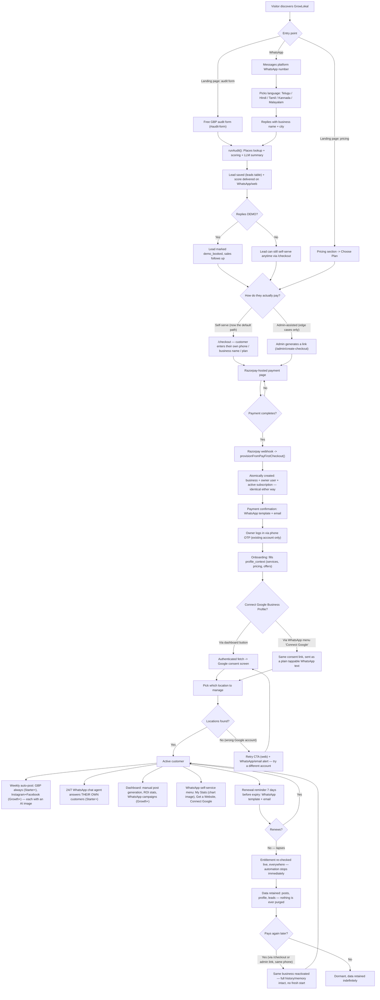

# Journeys — customer lifecycle, admin operations, system classification

Two diagrams answering "what happens end-to-end" and "who operates what."
Pairs with `ARCHITECTURE.md` (the system map), `FLOW.md` (request-by-request
traces), and `DECISIONS.md` (why each piece exists). Everything here reflects
what's actually built as of 2026-08-18 (updated same day — public self-serve
checkout + GBP OAuth UX polish) — not the aspirational version.

---

## 1. Customer journey — signup to end

**What makes this different from the obvious "signup form" journey:** there is
no self-serve *signup* at all (retired 2026-08-18 — see `DECISIONS.md`). A
business only ever comes into existence the moment a payment succeeds
(`provisionFromPayFirstCheckout()`) — but as of the same day, that payment no
longer needs a human involved to initiate: `/checkout` lets the customer pay
directly, with the admin-assisted link kept only for edge cases. Either path
converges on the exact same atomic provisioning logic. The free audit is a
completely separate, always-on lead magnet that never creates an account — it
only ever writes a `leads` row, and doesn't gate access to `/checkout` at all
(a visitor can skip the audit entirely and subscribe straight from pricing).

**GBP connection is now a loop, not a dead end.** Reachable from two places
(dashboard button or the WhatsApp menu, same underlying consent-URL builder),
and if the connected Google account has no Business Profile locations, the
customer gets nudged to retry — on the web page directly, and via a
WhatsApp/email alert in case they closed the tab.

**The "end" of this journey isn't deletion.** Lapsing only ever flips
`businesses.status` — nothing is purged. A customer who leaves and pays again
in 3 months resumes with their actual post history, not a blank slate (this
is also why the WhatsApp "My Stats"/social-post memory features feel
continuous rather than reset).

---

## 2. Admin journey — checking to monitoring

```mermaid
flowchart TD
    A0[Admin / founder]

    A0 --> A1[CHECKING: leads]
    A1 --> A2["/leads — filter by stage, 'assign to me'"]
    A2 --> A3{Needs a hand-crafted checkout?}
    A3 -->|"Rare now — custom deal, or lead stuck on /checkout"| A4["/admin/create-checkout — generate a Razorpay link manually"]
    A4 --> A5["Send the link manually on WhatsApp"]
    A3 -->|"Usual case — self-serve"| A6["Most leads now just pay via /checkout themselves — nothing for admin to do"]

    A0 --> B1[CHECKING: escalations]
    B1 --> B2["'Get a Website' taps -> WhatsApp template + OPS_ALERT_EMAIL"]
    B2 --> B3["Follow up with the customer directly"]
    B1 --> B4["GBP 'no locations found' alerts — usually self-resolves via the customer's own retry, but worth a periodic glance"]

    A0 --> C1[CHECKING: external dependency status]
    C1 --> C2["Meta WhatsApp template approvals — renewal, payment, website-request, GBP-no-locations"]
    C1 --> C3["Google Cloud OAuth client + GBP API access"]
    C1 --> C4["Razorpay live keys + webhook secret + Plan IDs (RAZORPAY_PLAN_ID_STARTER/GROWTH — /checkout 503s cleanly if unset, but check anyway)"]

    A0 --> D1[MONITORING: system health]
    D1 --> D2["Uptime Kuma dashboard (home lab) — is the VPS API up?"]
    D1 --> D3["docker compose ps — api / worker / postgres / redis / caddy"]
    D1 --> D4["Worker process alive? Silent failure mode if not — no error, posts just stop"]

    A0 --> E1[MONITORING: cost]
    E1 --> E2["LLM + image spend — OpenRouter/Gemini/Anthropic + R2 storage"]
    E1 --> E3["WhatsApp template message costs"]
    E1 --> E4["Google Places API key — NO billing cap yet, known open risk"]
    E1 --> E5["/api/checkout is now public — rate-limited (10/min/IP), but watch for abuse now that no human gates it"]

    A0 --> F1[MONITORING: data + backups]
    F1 --> F2["Nightly Postgres backup -> B2/R2 (backup.sh) — restore untested"]
    F1 --> F3["Twenty CRM (home lab) — manual lead/deal tracking today, no API sync yet"]

    A0 --> G1[MAINTAINING: infrastructure]
    G1 --> G2["VPS: postgres + redis + api + worker + caddy — fully allocated at 8GB"]
    G1 --> G3["Home lab: n8n + Kuma + Twenty — tools only, each self-contained"]
    G1 --> G4["Cloudflare: DNS + Tunnel (home lab), direct (VPS)"]
```

**The recurring theme in this journey:** almost everything here is either a
human-in-the-loop step (chasing external approvals, the now-rare manual
checkout) or a "nothing will tell you if this breaks" gap (worker process
dying silently, no Places API billing cap, backups never restore-tested).
This is the honest ops picture for a solo founder, not an idealized one — see
the "Smaller/operational gaps" section of `ARCHITECTURE.md` for the running
list.

**What changed here on 2026-08-18:** lead-to-paid used to always route through
an admin generating a link — now it usually doesn't. The admin's real
remaining job on the payment side is closer to "make sure the Plan IDs and
webhook secret stay valid" than "personally hand-hold every sale," which is
the actual point of having asked for self-serve in the first place.

---

## 3. System classification — what runs where, for whom

| System | Serves | Runs on | Classification |
|---|---|---|---|
| Landing page, pricing, audit form, booking microsite | Public / prospective leads | Vercel | Customer-facing |
| `/checkout` (public self-serve payment) | Anyone, no login — added 2026-08-18 | Vercel + Razorpay | Customer-facing |
| Owner dashboard (`/dashboard/:id`, onboarding, campaigns) | Paying customers only | Vercel | Customer-facing |
| GBP OAuth connect (`/dashboard/:id/gbp/connect`, `routes/gbp-oauth.ts`) | Paying customers only, from the dashboard OR WhatsApp | Vercel + VPS (`api`) + Google | Customer-facing |
| WhatsApp lead-gen bot (audit + language picker) | Prospective leads | VPS (`api` container) | Customer-facing |
| WhatsApp customer self-service menu (My Stats, Get a Website, Connect Google) | Paying customers only | VPS (`api` container) | Customer-facing |
| WhatsApp chat agent (answers a business's own customers) | The business's end customers | VPS (`api` container) | Customer-facing (white-label) |
| `/leads`, `/admin/create-checkout` | Sales/admin only — now a secondary/backup path, not the default | Vercel | Admin-facing |
| Twenty CRM | Admin/finance | Home lab | Admin-facing |
| Uptime Kuma | Admin/ops | Home lab | Admin-facing (monitoring) |
| Weekly auto-post cron, renewal reminders | No direct user — runs unattended | VPS (`worker` container) | Automation |
| Entitlement checks (`getEntitlement`/`hasMinPlan`) | Every gated route, live | VPS (`api`/`worker`) | Automation (security-critical) |
| Postgres, Redis (production) | Everything above | VPS | Infrastructure |
| n8n | Ad-hoc internal automation, not wired to any customer flow today | Home lab | Infrastructure (tools) |
| Razorpay, Meta WhatsApp Cloud API, Google GBP/Places, OpenRouter/Gemini/Anthropic, MSG91, Amazon SES, Cloudflare R2, QuickChart | Paid/free third-party dependencies everything above calls into | External SaaS | External dependency |

**Reading this table:** customer-facing systems are the only ones an actual
paying business ever touches directly. Admin-facing systems are for you (or a
future hire) only. Automation runs with no human watching it minute-to-minute
— which is exactly why the entitlement re-check on every run matters so much:
it's the only thing standing between "a lapsed business" and "a lapsed
business that keeps costing money anyway."
